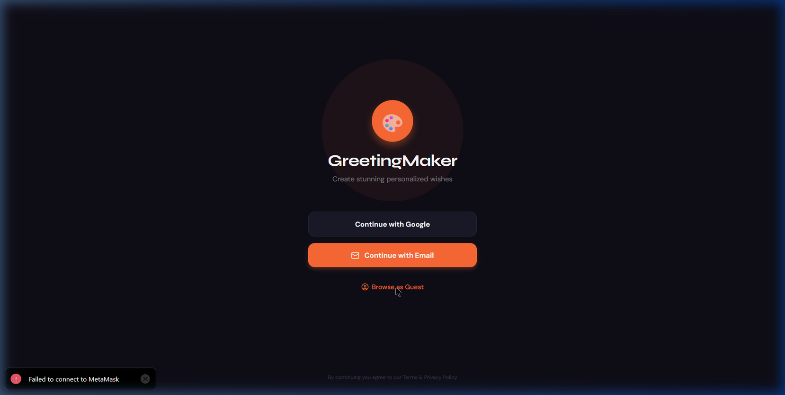

# GreetingMaker - Custom Greetings & Wishes App



A React Native (Expo) application for creating personalized greeting cards with automatic profile overlay.

**[🎥 Watch Demo Video](https://drive.google.com/file/d/1njiCWt6EKurIt57Cy4XuJgYU4c0LcTA_/view?usp=drive_link)**

## 🌟 Features

- **Authentication**: User Login flow (Google, Email, or Guest) and Profile setup (Capture user name and profile picture).
- **Home Page**: Categorized templates (Birthday, Anniversary, Festivals) displayed in a grid view, with live preview overlays showing the user's name and photo by default.
- **Personalization & Sharing**: Action button to merge layers into a single image, with native share sheet integration for WhatsApp, Instagram, Email, etc.
- **Monetization (Premium Templates)**: 'Pro' badge overlays for premium templates, locking them behind a simulated paywall, triggering an elegant subscription modal upon tap.

## 🛠️ Tech Stack

| Layer | Tool |
|---|---|
| Framework | React Native + Expo (SDK 54) |
| Navigation | Expo Router (file-based) |
| Auth | Firebase Auth (mock for demo) |
| State | Zustand |
| Image Capture | `react-native-view-shot` (native) / `html2canvas` (web) |
| Sharing | `expo-sharing` |
| Icons | `lucide-react-native` |
| Fonts | `@expo-google-fonts/nunito`, `@expo-google-fonts/playfair-display` |

## 🚀 Getting Started

### Prerequisites
- Node.js 18+
- npm or yarn

### Install

```bash
git clone https://github.com/AkprasadoP/classPlus-assesment.git
cd classPlus-assesment
npm install
```

### Firebase Setup

To connect the application to a real backend:
1. Go to the [Firebase Console](https://console.firebase.google.com/) and create a project.
2. Enable [Firestore Database](https://console.firebase.google.com/project/_/firestore) and [Firebase Storage](https://console.firebase.google.com/project/_/storage).
3. Go to [Project Settings](https://console.firebase.google.com/project/_/settings/general) and register a Web App to get your Firebase configuration.
4. Copy `.env.example` to `.env` and fill in your keys:

```bash
cp .env.example .env
```

If `.env` is missing, the app will safely fall back to local mock data for the demo.

### Run locally

```bash
npx expo start
```

Press `w` to open the Web preview, or `a` for Android.

### Build APK

```bash
eas build -p android --profile preview
```

## 📁 Project Structure

```
├── app/
│   ├── (auth)/          # Login & Profile Setup
│   ├── (tabs)/          # Home feed + Profile tab
│   └── card/[id].tsx    # Full-screen preview & share
├── components/
│   ├── GreetingCard.tsx  # Core overlay component
│   ├── CategoryPill.tsx  # Filter chips
│   └── PremiumModal.tsx  # Upsell popup
├── store/
│   └── userStore.ts      # Zustand state
├── services/
│   ├── captureService.ts     # Native capture
│   ├── captureService.web.ts # Web capture (html2canvas)
│   └── firebase.ts           # Auth service
└── constants/
    ├── Colors.ts         # Theme palette
    └── mockData.ts       # Template data
```

## 🎨 Design

- **Primary**: `#FF6B35` (Warm Orange)
- **Secondary**: `#1A1A2E` (Deep Navy)
- **Accent**: `#22C55E` (Avatar Ring Green)
- **Gold**: `#F59E0B` (Premium Badges)
- **Fonts**: Playfair Display (headings), Nunito (body)

## 📹 Demo Flow

1. App Launch → Login Screen
2. Login → Profile Setup
3. Home Screen → Scroll grid with live overlays
4. Tap Premium Card → Upsell Modal
5. Tap Free Card → Full Preview
6. Tap Share → Native share / download

## 📄 License

MIT
